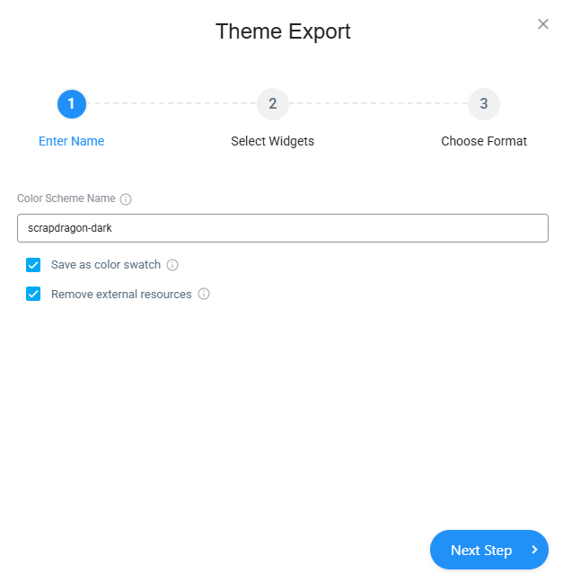
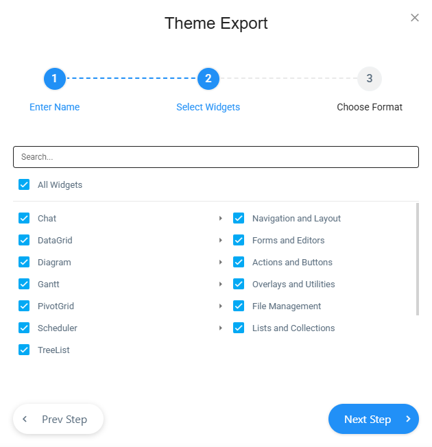
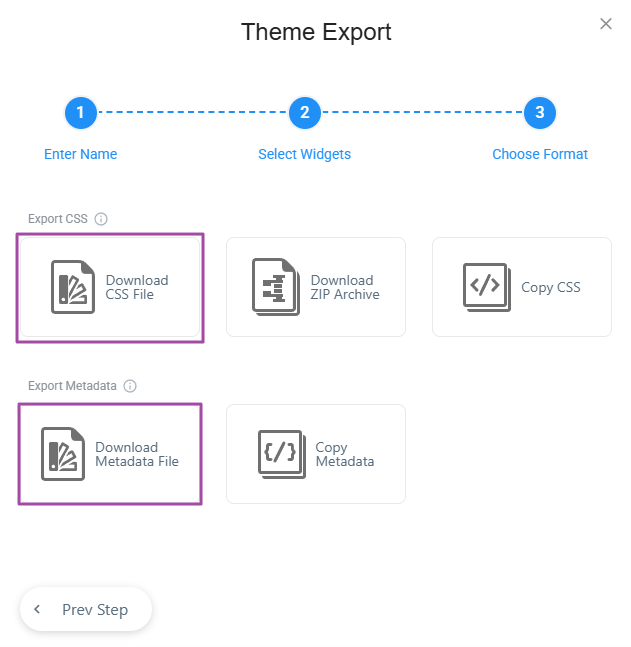

# Scrap Dragon Web Styles

This repository contains base styles for **Scrap Dragon Web** applications. The styles are designed to work with **DevExtreme Themes** and can be customized using the **[DevExtreme Theme Builder](https://devexpress.github.io/ThemeBuilder/)**.

## 🎨 Editing & Customizing Themes
You can edit these themes online using the **[DevExtreme Theme Builder](https://devexpress.github.io/ThemeBuilder/)**.

### Steps to Import and Edit:
1. Open the **[DevExtreme Theme Builder](https://devexpress.github.io/ThemeBuilder/)**.
2. Click **"Import Metadata"** and select a `.json` file from this repository.
3. Customize the theme as needed.
4. Export the theme to generate an updated `.css` file and `.json` metadata file.



6. Save both files back into this repository for future use.

## 📁 File Naming Conventions
Exported styles should follow the naming pattern:
- **Dark Mode:** `{AUTO_GENERATED_THEME_NAME}-scrapdragon-dark.css`
- **Light Mode:** `{AUTO_GENERATED_THEME_NAME}-scrapdragon-light.css`

### Example:
- `dx.generic.scrapdragon-light.css` (Generic Light Theme)
- `dx.fluent.scrapdragon-dark.css` (Fluent Dark Theme)

## 📌 Usage
To use a theme in your ScrapDragon Web application, include the CSS file in your HTML:
```html
<link rel="stylesheet" href="https://cdn.jsdelivr.net/gh/scrapdragondev/ScrapDragon.Web.Styles@main/css/dx.fluent.scrapdragon-dark.css">
```

## 📂 Icons
This repository also includes a set of icons located in the `icons/` folder.

### 🔹 How to Use the Icons:
Since browsers may block cross-origin requests for images in CSS (when using a CDN), it's recommended to **copy the `icons/` folder into your own project** and reference them locally.

### 📥 Steps to Copy Icons:
1. Download the `icons/` folder from the repository.
2. Place it inside your project's **public assets** folder (e.g., `/wwwroot/icons/` for .NET projects).
